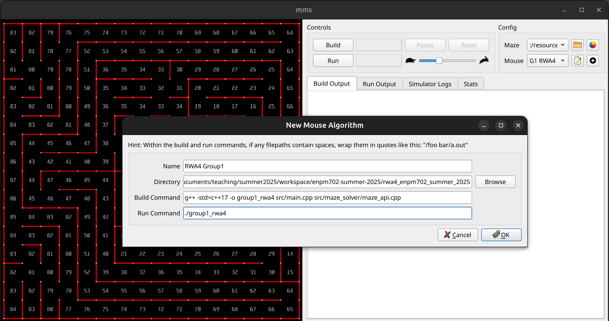
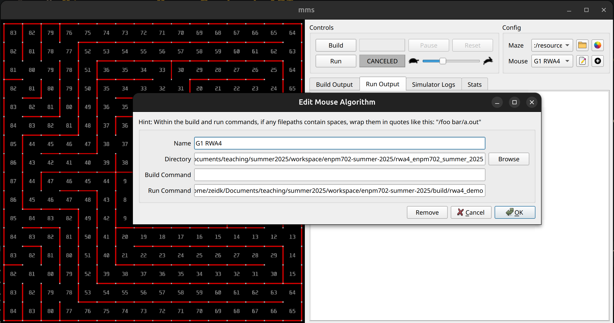

# Micromouse Maze Control API

## Overview
The Micromouse Maze Interface provides methods to control and visualize a robot navigating a maze. The methods have been refactored from the original versions to use snake_case naming conventions and instance methods instead of static methods.

The API communicates with an external maze simulator through a text-based protocol using standard I/O streams, enabling modular design and easy testing.

See:

- <a href="https://github.com/mackorone/mms" target="_blank" rel="noopener noreferrer">Micromouse Simulator Homepage</a>
- <a href="https://github.com/mackorone/mms-cpp/tree/master" target="_blank" rel="noopener noreferrer">Micromouse Simulator CPP Example</a>

## Features
- Real-time maze navigation with bidirectional communication
- Wall detection and avoidance capabilities
- Color and text marking system for visualization
- Reset handling for simulation restarts
- Process separation between solver and simulator
- Language-independent communication protocol

## Getting Started

### Maze Simulator

2. Download the precompiled version of the maze: [Linux precompiled version](https://github.com/mackorone/mms/releases/download/v1.2.0/linux.zip)
3. Unzip the file
4. `chmod +x mms-x86_64.AppImage`
5. Run: `./mms-x86_64.AppImage --appimage-extract` which creates the folder `squashfs-root`
6. `cd squashfs-root`
7. `chmod +x mms`
8. `./mms`
9. The maze simulator should start

### Configuration
In the simulator, click on the + icon to configure the simulator to use your program to control the robot.

#### Build Executable
There are two ways to generate the executable for your maze solver.

- Generate your maze solver executable from the simulator. You need to fill out the *Build Command* field with all `.cpp` files.

  

- An alternative is to leave the *Build Command* field blank and build the executable using CMake. The provided `CMakeLists.txt` does that. **Note** that you still need to provide *Directory* and the path to the executable in *Run Command*.

  

#### Run Executable
Edit the field `Run Command` to make it point to the generated executable.

## API Documentation
The main API is provided through the `MazeControlAPI` class which offers:

### Navigation Methods
- `move_forward(int distance = 1)` - Move the robot forward
- `turn_left()` - Turn the robot counter-clockwise
- `turn_right()` - Turn the robot clockwise

### Wall Detection
- `has_wall_front()` - Check for wall in front
- `has_wall_left()` - Check for wall to the left
- `has_wall_right()` - Check for wall to the right

### Maze Properties
- `get_maze_width()` - Get maze width in cells
- `get_maze_height()` - Get maze height in cells

### Visualization and Manipulation
- `set_color(int x, int y, char color)` - Set cell color
- `clear_color(int x, int y)` - Clear cell color
- `clear_all_color()` - Clear all colors
- `set_text(int x, int y, const std::string& text)` - Set cell text
- `clear_text(int x, int y)` - Clear cell text
- `clear_all_text()` - Clear all text
- `set_wall(int x, int y, char direction)` - Add wall
- `clear_wall(int x, int y, char direction)` - Remove wall

### Reset Handling
- `was_reset()` - Check if simulation was reset
- `ack_reset()` - Acknowledge reset handling

## Communication Protocol
The API uses three standard I/O streams for communication:

- **std::cout** - Sends commands to the external simulator
- **std::cin** - Receives responses from the simulator
- **std::cerr** - Outputs debug information separate from the protocol. Use **std::cerr** to print in the simulator's **Run Output** tab.

This design enables:
- Process separation between solver and simulator
- Language-independent implementation
- Easy testing and debugging
- Command logging and replay capabilities

## Algorithm

The maze_search folder provides a simple solver which demonstrates how a C++ program can interface with the simulator. The solver provided in the main function (main.cpp) is used for demonstration purposes and uses the left-hand rule:

1. Always prefer turning left when possible
2. Turn right when blocked until a path is found
3. Move forward and repeat

This simple algorithm will solve any simply-connected maze by following the left wall until reaching the exit. As mentioned, this is used for demonstration purposes since the different maze files from the simulator do not have an exit.

You can complete the final project using this provided folder.
